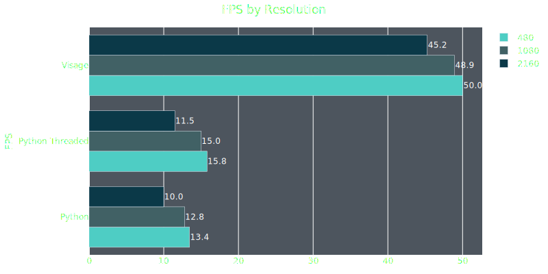

# Visage
A high-performance, GPU-accelerated pipeline for facial detection and recognition in video streams. Built with a FFmpeg/Opencv/TensorRT stack in C++, Visage is optimized to process video at maximum throughput.


## Requirements
If using the associated docker image, all Visage needs is an Nvidia GPU with updated drivers.
Otherwise, the required libraries are listed in the install section.

**Disclaimer: This has only been tested on an Nvidia GTX 1080 Ti, but any newer GPU should work as long as the drivers are current.


## Install
The simplest way to run Visage is download the docker image. Alternatively, you can build from source. However, this is a non-trivial task and would require building and linking the dependencies yourself.

The project was built using these libraries:  
Cuda-11.8  
libcudnn8  
OpenCV-4.10     
FFmpeg-4.4  
Video_Codec_SDK_13.0.19  
nv-codec-headers-11.1.5.2  
libtorch-1.12.1  
TensorRT-8.6.1.6  

The setup process also involves copying certain header files (related predominantly to Video_Codec_SDK for HW decoding).
These steps are demonstrated in the accompanying 
Dockerfile.

## Usage
Visage is available through Docker, so first download the image
```
docker pull astaileyyoung/visage
```

Visage was built with GPU-accelerated decoding using the NVIDIA Video_Codec_SDK library, so you must run the image with GPU options enabled
```
docker run -it --rm --gpus all \
    -e NVIDIA_DRIVER_CAPABILITIES=all \
    -v /path/to/mount/dir \
    visage 
```

If you need to display the video, you'll need to specify that option when running the image
```
docker run -it --rm --gpus all \
    -e NVIDIA_DRIVER_CAPABILITIES=all \
    -e DISPLAY=$DISPLAY \
    -v /tmp/.X11-unix:/tmp/.X11-unix \
    -v /path/to/mount/dir \
    visage
```

This command will only work on Linux. If using a different OS, however, this command will have to be adapted to your environment.

Once inside the docker environment, run Visage as so:
```
visage <src> [--dst <output>] [--frameskip <N>] [--log_level <LEVEL>] [--show]
```

### Arguments
| Argument            | Description                                 | Required/Optional |
|---------------------|---------------------------------------------|-------------------|
| `<src>`             | Path to the input video file                | Required          |
| `--dst <output>`    | Output file path                            | Optional          |
| `--frameskip <N>`   | Number of frames to skip                    | Optional          |
| `--log-level <LVL>` | Logging level (e.g., 0=ERROR, 1=INFO, 2=DEBUG) | Optional       |
| `--show`            | Show video in window                        | Optional (flag)   |


## Benchmarks
Visage uses a FFmpeg/OpenCV/TensorRT stack for high-performance facial detection and recognition, which offers a large performance boost compared to using Python + DeepFace. 

Detection uses yolov11m-face converted to TensorRT with INT8 precision. Embedding is through a TensorRT-converted Facenet model. 

Code for the benchmarking is in /notebooks. The sample videos used in the benchmarks can also be download from the notebook.

My specs:  
Ubuntu 24.04  
CUDA 12.8  
cuDNN 9.10.1  
Nvidia driver: 570.153.02  
NVIDIA GeForce GTX 1080 TI

#### Detection and embeddings speeds by resolution 



For details on the benchmarking parameters, check out benchmarks.ipynb in notebooks.


## To Do
- Add CPU support
- Implement optical flow for accurate detection with frameskipping  
- Use threading to boost performance
- Extend batch support to detection
- Add support for additional models
- Integrate real-time identification with Qdrant vector database


## Contributing
Contributions are welcome! If you have ideas for features, improvements, bug fixes, or just want to get involved, please open an issue or pull request.

I am not a professional software developer, so any help—whether it’s code, documentation, testing, or suggestions—is appreciated. If you are new to open source or need guidance, feel free to ask questions in issues.

If you use Visage, we encourage you to share your benchmarking results!
Open a [Benchmark Results Issue](https://github.com/astaileyyoung/Visage/issues/new?template=benchmark-results.yml) using the template and help build a performance database for different GPUs and systems.

You can find the benchmark.py script in /scripts. Simply run the script and it will download the sample videos, perform detection/embedding, and spit out a file with the results. This file can then be uploaded through the aforementioned template.


